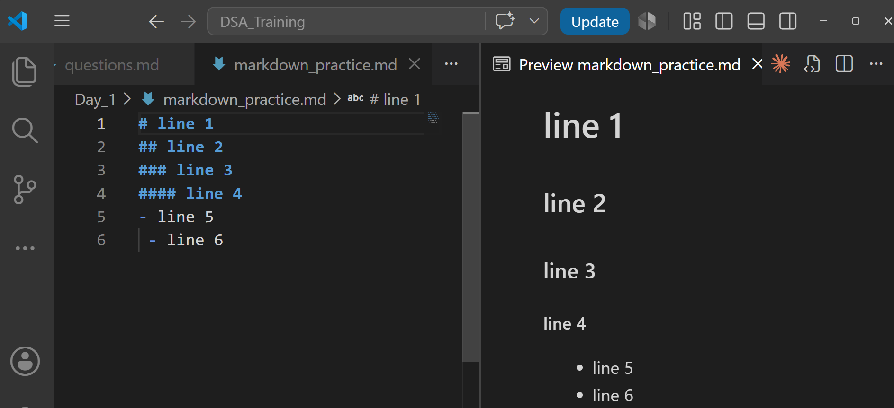
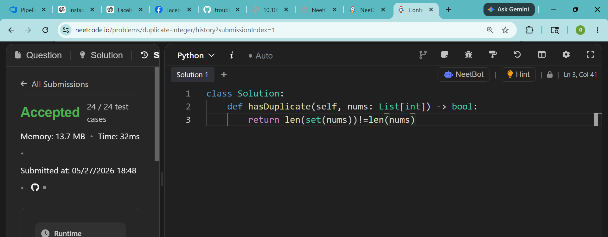

# line 1
## line 2 
### line 3
#### line 4
- line 5
 - line 6

 

 

 

- I am from `NITTE`

print("hello world")

```python
print("hello world")
```

- line 1
- line 2
    - line 3
        - line 4
    - line 5
- line 6

1. line 1
2. line 2
    1. line 3
        1. line 4
    2. line 5
### line 6
1. line 1
1. line 2
    1. line 3
        1. line 4
    1. line 5